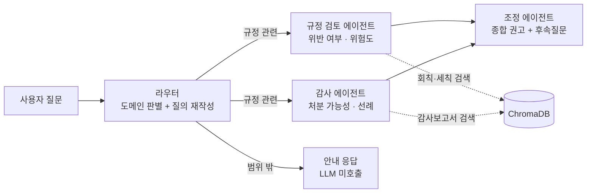

# 학생회 규정 AI 어시스턴트

> 학생회 회칙·세칙·감사보고서를 근거로 **"이거 규정 위반인가요? 감사 처분 받나요?"**에 답하는 멀티에이전트 RAG 챗봇

인하대학교 학생회를 대상으로 실제 운영 중인 서비스입니다.
LangGraph 기반 4개 AI 에이전트가 실제 규정 문서를 검색해 **위반 여부 · 감사 처분 가능성 · 최종 권고안**을 조항 단위 출처와 함께 제시합니다.


---

## 왜 만들었나

학생회 임원은 매 학기 바뀌지만, 지켜야 할 규정은 회칙·세칙 여러 건에 흩어져 있습니다.
그 결과 **"몰라서" 규정을 어기고 감사에서 처분을 받는 일**이 반복됩니다 — 사전 인준 없이 예산을 집행하거나, 증빙을 갖추지 않고 물품을 구매하거나.

문제는 규정을 안 읽어서가 아니라 **찾기 어려워서**입니다. 40페이지 세칙에서 내 상황에 해당하는 조항을 찾고, 과거 감사보고서에서 유사 사례가 어떻게 처분됐는지 확인하는 일은 임원 개인이 감당하기 어렵습니다.

이 프로젝트는 그 과정을 **자연어 질문 하나**로 대체합니다.

## 어떻게 동작하나

질문 하나에 **관점이 다른 두 전문가**를 병렬로 붙이고, 세 번째 에이전트가 종합합니다.



- **규정 검토 에이전트**는 "이 행위가 회칙·세칙에 어긋나는가"를 봅니다
- **감사 에이전트**는 "실제로 처분받을 가능성이 있는가"를 과거 감사 선례에서 확인합니다
- 둘은 **동시에** 실행되고, **조정 에이전트**가 결과를 종합합니다. 두 판단이 갈릴 때만 그 이유를 답변에 노출합니다

### 실제 답변 예시

> **Q. 비룡제 VAT 누락 관련해서 어떤 감사 처분이 있었나요?**
>
> **위험도: 높음**
>
> **핵심 요약** — 2025학년도 제44대 총학생회의 비룡제 사업 중 발생한 VAT 누락 및 인준 없이 졸업준비금으로 충당·지출한 건에 대해, 직무태만 및 재정상 손실 발생을 사유로 총학생회장·부총학생회장에게 **해임건의**, 총학생회에 **예산집행정지 21일**이 의결되었습니다.
>
> **최종 권고** — 「감사처분에 관한 세칙」 1-나(직무태만으로 재정상 손실) 및 예산집행정지기준 6-다(인준 없이 사업 진행)에 따라 (…)
>
> 📄 근거: `25-2 총학생회_특별감사_보고서.pdf` · `감사처분에 관한 세칙.pdf`

## 주요 기능

| 기능 | 설명 |
|---|---|
| **멀티에이전트 분석** | 규정 검토·감사 분석을 병렬 실행 후 종합 권고 도출 |
| **조항 단위 출처 인용** | 답변 근거를 문서·조항까지 표시, 클릭하면 원문 문단 확인 |
| **결정론적 위험도 판정** | LLM 텍스트 파싱이 아닌 구조화 출력(enum) 기반 계산 |
| **실시간 스트리밍** | 진행 단계 표시 → 에이전트별 부분 결과 → 최종 답변 토큰 스트리밍 |
| **대화 맥락 유지** | "그럼 처분은 얼마나 돼?" 같은 후속 질문을 이전 대화 기준으로 해석 |
| **스캔본 PDF 자동 처리** | 텍스트 레이어 없는 문서를 Gemini 멀티모달로 추출 (OCR 엔진 불필요) |
| **도메인 가드** | 학생회 업무 밖 질문은 LLM 호출 없이 안내 응답 |
| **운영 대시보드** | 질의 수·응답 시간·토큰·비용·방문자 추이 자체 계측 (`/stats`) |

## 기술적으로 신경 쓴 부분

<details>
<summary><b>1. 한글 PDF의 널바이트 오염 — 검색 품질이 무너지던 원인</b></summary>

일부 한글 PDF는 공백을 널바이트(`\x00`)로 추출합니다. 색인된 28개 문서 중 **14개가 오염되어 공백 비율 0%**, 즉 모든 단어 경계가 사라진 상태였습니다. 텍스트는 "있어 보이지만" 임베딩 품질이 무너져 핵심 세칙들이 검색 결과에서 밀려났습니다.

→ 인제스천 단계에 정규화(널바이트·특수공백 복원, NFKC, 제어문자 제거)를 넣어 해결.
</details>

<details>
<summary><b>2. 문서 유형 분리 검색 — 코퍼스가 커질수록 악화되던 구조</b></summary>

감사보고서(17건)가 회칙·세칙(11건)보다 수적으로 많아, 유형 구분 없이 상위 K개를 뽑으면 **정작 규정 조항이 감사보고서에 밀려났습니다.** "회식비 사용 가능한가요?"에 재정·회계 세칙이 검색되지 않는 상태였습니다.

→ 문서를 `regulation`/`audit`으로 분류해 메타데이터에 저장하고, 규정 검토 에이전트는 회칙·세칙을, 감사 에이전트는 감사 선례를 각각 보장받도록 분리 검색. 문서가 늘어나도 재발하지 않는 구조.
</details>

<details>
<summary><b>3. 본문이 이미지인 PDF 탐지 — 절대 길이 기준의 함정</b></summary>

"추출 텍스트가 50자 미만이면 스캔본"이라는 기준은, **표지와 목차만 텍스트고 본문이 이미지인 문서**를 놓칩니다. 18페이지 감사보고서에서 851자(목차)만 추출된 채 정상 처리된 사례가 있었습니다.

→ 판정 기준을 **페이지당 평균 글자 수**로 변경. 해당 문서는 1청크 → 19청크로 복구.
</details>

<details>
<summary><b>4. 도메인 가드로 비용 95% 절감</b></summary>

"쿠팡에서 실수로 포인트 적립을 했어" 같은 개인 소비 질문이 규정 분석 파이프라인으로 오분류되어, 불필요한 검색과 3회의 LLM 호출이 발생했습니다(질의당 약 16,000 토큰).

→ 라우터 판단 기준을 "질문의 주체가 학생회 활동인가"로 명문화하고 few-shot 예시 추가, 범위 밖 질문은 LLM 호출 없이 고정 안내로 응답. **토큰 16,780 → 897 (약 95% 절감).** 자체 구축한 관측 대시보드로 발견한 문제입니다.
</details>

<details>
<summary><b>5. 무료 티어에서 안정적으로 돌리기</b></summary>

임베딩 API의 쿼터 제한(429)과 일시 장애(503)로 일괄 색인이 중단되곤 했습니다.

→ 배치 축소 + 지수 백오프 재시도, 개별 문서 실패가 전체를 중단시키지 않도록 격리. 28개 문서 일괄 색인이 무인으로 완주합니다.
</details>

## 기술 스택

| 영역 | 기술 |
|---|---|
| **LLM · 임베딩** | Google Gemini 3.6 Flash · gemini-embedding-2 |
| **에이전트 오케스트레이션** | LangGraph 1.0 (조건부 라우팅, fan-out 병렬, 상태 리듀서) |
| **RAG** | ChromaDB · pypdf · 재귀적 청킹(1000자/200 오버랩) |
| **백엔드** | Python 3.12 · FastAPI · SSE · SQLite |
| **프론트엔드** | Next.js 16 (App Router) · React 19 · TypeScript · Tailwind CSS v4 |
| **배포** | Tailscale Funnel (셀프호스팅) · Docker Compose + Caddy (VPS 이전용) |

## 프로젝트 구조

```
├── documents/              # 규정 PDF 원본 (git 제외, 로컬에서 관리)
├── v2/
│   ├── api/                # FastAPI 백엔드
│   │   ├── app/
│   │   │   ├── agents/     # graph.py(LangGraph) · prompts.py · schemas.py
│   │   │   ├── rag/        # ingest.py(추출·정규화) · store.py(벡터 검색)
│   │   │   ├── main.py     # SSE 채팅 API · 문서/지표 엔드포인트
│   │   │   ├── db.py       # 분석 이력 · 운영 지표 · 방문자 로그
│   │   │   └── config.py
│   │   ├── ingest_folder.py  # 폴더-색인 동기화 CLI
│   │   └── smoke_test.py
│   └── web/                # Next.js 프론트엔드
│       └── src/app/        # page.tsx(채팅) · stats/(운영 대시보드)
├── deploy/                 # Docker Compose + Caddy 구성
└── start-server.ps1        # 로컬 서버 기동/종료 스크립트
```

> `v2/`는 Gradio 기반 프로토타입(v1)을 전면 재구축한 이력에서 온 이름입니다.

## 시작하기

### 1. 백엔드

```bash
cd v2/api
python -m venv .venv
.venv\Scripts\activate           # Linux/Mac: source .venv/bin/activate
pip install -r requirements.txt
cp .env.example .env             # GEMINI_API_KEY 입력
uvicorn app.main:app --port 8000
```

> API 키가 없어도 **목업 모드**로 전체 플로우를 실행해볼 수 있습니다 (LLM 호출 없이 canned 응답).
> 키 발급: [Google AI Studio](https://aistudio.google.com/apikey)

### 2. 프론트엔드

```bash
cd v2/web
npm install
npm run dev                      # http://localhost:3000
```

### 3. 규정 문서 색인

`documents/` 폴더에 PDF를 넣고 실행하면 폴더 상태와 색인을 동기화합니다.

```bash
cd v2/api
.venv\Scripts\python ingest_folder.py
```

- **신규** 파일은 색인, **수정된** 파일은 재색인, **삭제된** 파일은 색인에서 제거
- 스캔본 PDF는 Gemini 멀티모달로 자동 추출
- 쿼터 초과·일시 장애 시 자동 백오프 재시도

### 4. 테스트

```bash
cd v2/api
python smoke_test.py             # 벡터 스토어 + 파이프라인 + 라우팅 (목업 모드)
```

## API

| 메서드 | 경로 | 설명 |
|---|---|---|
| `POST` | `/api/chat` | SSE 스트리밍 분석 — `stage` / `agent_done` / `token` / `result` 이벤트 |
| `GET` | `/api/health` | 상태 확인 (모드, 모델, 색인 청크 수) |
| `GET` | `/api/stats` | 운영 지표 (질의 수, 응답 시간, 토큰, 비용, 방문자) |
| `GET` | `/api/stats/export` | 지표 CSV 내보내기 |
| `GET` | `/api/history` | 분석 이력 |
| `POST` `GET` `DELETE` | `/api/documents` | 문서 색인 관리 (운영용) |

## 배포

Docker Compose + Caddy로 단일 서버에 배포할 수 있습니다. 자세한 절차는 **[DEPLOYMENT.md](DEPLOYMENT.md)** 참고.

```bash
cp deploy/.env.example deploy/.env    # 키·도메인 입력
cd deploy && docker compose up -d --build
```

현재는 개인 PC + Tailscale Funnel로 셀프호스팅 중이며(서버 임대 비용 0원), 사용자 증가 시 위 구성으로 VPS 이전이 가능합니다.

## 라이선스 및 주의

- 이 저장소에는 **규정 PDF 원본이 포함되어 있지 않습니다** (학생회 내부 문서).
- 본 서비스의 AI 분석은 **참고용**이며, 최종 판단은 감사위원회 및 관련 규정을 따릅니다.
