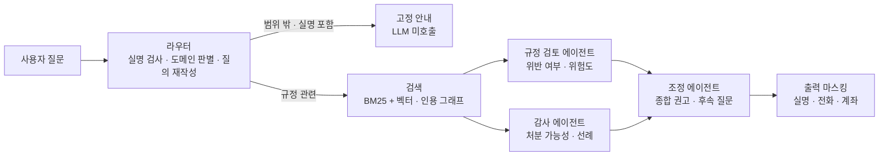
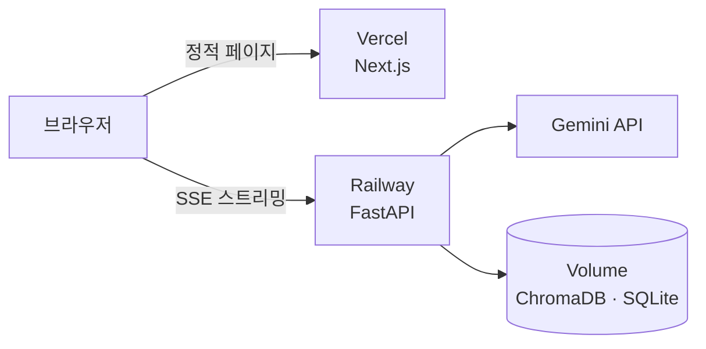

<div align="center">

# 학생회 규정 AI 어시스턴트

**학생회 회칙·세칙·감사보고서를 근거로 "이거 규정 위반인가요? 감사 처분 받나요?"에 답하는 멀티에이전트 RAG 챗봇**

인하대학교 학생회를 대상으로 실제 운영 중인 서비스입니다.

[](https://ai-agent-patrick-16be.vercel.app)
[](https://github.com/Patrick-SCH03/Student-Council_AI_Agent/actions/workflows/ci.yml)

</div>

---

## 왜 만들었나

학생회 임원은 매 학기 바뀌지만, 지켜야 할 규정은 회칙·세칙 여러 건에 흩어져 있습니다.
그 결과 **"몰라서" 규정을 어기고 감사에서 처분을 받는 일**이 반복됩니다 — 사전 인준 없이 사업을 진행하거나, 증빙을 갖추지 않고 물품을 구매하거나.

문제는 규정을 안 읽어서가 아니라 **찾기 어려워서**입니다. 40페이지 세칙에서 내 상황에 해당하는 조항을 찾고, 과거 감사보고서에서 유사 사례가 어떻게 처분됐는지 확인하는 일은 임원 개인이 감당하기 어렵습니다.

이 프로젝트는 그 과정을 **자연어 질문 하나**로 대체합니다.

---

## 기술 스택

<table>
<tr>
<td align="center" width="33%">

### AI · RAG


**Gemini 3.7 Flash**<br/>
`gemini-embedding-2`<br/>
**LangGraph 1.0**<br/>
**ChromaDB** · **NetworkX**

</td>
<td align="center" width="33%">

### Back-end


**FastAPI** · SSE 스트리밍<br/>
**SQLite** · **Docker**<br/>
**Railway** (배포)

</td>
<td align="center" width="33%">

### Front-end


**Next.js 16** (App Router)<br/>
**React 19** · **TypeScript**<br/>
**Tailwind CSS v4**<br/>
**Vercel** (배포)

</td>
</tr>
</table>

<div align="center">

**CI/CD** &nbsp;·&nbsp;  &nbsp; GitHub Actions → Vercel · Railway 자동 배포

</div>

| 영역 | 선택 | 이유 |
|---|---|---|
| **LLM** | Gemini 3.7 Flash | 한국어 규정 해석 품질 대비 비용이 낮고, 스캔본 PDF를 멀티모달로 직접 파싱할 수 있습니다 |
| **오⁠케⁠스⁠트⁠레⁠이⁠션** | LangGraph 1.0 | 조건부 라우팅과 병렬 실행을 그래프로 선언합니다 — 에이전트를 추가해도 구조가 바뀌지 않습니다 |
| **벡⁠터 DB** | ChromaDB | 운영 중 문서 추가·삭제·재색인이 필요해, 인덱스 파일을 통째로 다시 만드는 방식(Faiss 등)보다 컬렉션 관리형이 맞습니다 |
| **검⁠색** | BM25 + 벡터 (RRF) | 규정 질의는 `제32조` 같은 정확한 표현과 의미 유사도가 둘 다 필요합니다 — 한쪽만으로는 놓칩니다 |
| **판⁠례 연⁠결** | 인용 그래프 (NetworkX) | 조항 참조를 정규식으로 추출해 구축 비용 0원 · 2초. LLM으로 그래프를 뽑는 GraphRAG는 문서 33건 규모에서 비용 대비 이득이 없습니다 |
| **스⁠트⁠리⁠밍** | SSE | 응답에 10초 안팎이 걸려 진행 상황 노출이 필수입니다. 단방향 스트림에 WebSocket은 과합니다 |
| **DB** | SQLite | 단일 인스턴스 운영 규모에서 별도 DB 서버는 과투자입니다 — 볼륨에 파일로 보존합니다 |

---

## 어떻게 동작하나

질문 하나에 **관점이 다른 두 전문가**를 병렬로 붙이고, 세 번째 에이전트가 종합합니다.



- **규정 검토 에이전트**는 "이 행위가 회칙·세칙에 어긋나는가"를, **감사 에이전트**는 "실제로 처분받을 가능성이 있는가"를 과거 감사보고서에서 확인합니다
- 두 에이전트는 **동시에** 실행되고, 조정 에이전트는 두 판단이 갈릴 때만 그 이유를 답변에 드러냅니다
- 검색은 두 에이전트 앞단에서 **한 번만** 수행합니다. 각자 돌리던 시절 두 결과가 매번 같았기 때문입니다
- "과거 처분 사례들"을 묻는 질문에만 **인용 그래프로 판례를 넓게 모읍니다.** 모든 질문에 켜면 질의당 +7원·+2초가 드는 것을 측정하고, 라우터가 판례형으로 판별한 질문으로 한정했습니다
- 개인정보는 **입구 · 프롬프트 · 출력 3단계**로 막습니다. 실명이 든 질문은 LLM을 부르기 전에 거절하고, 답변은 사용자에게 나가기 직전 코드가 한 번 더 지웁니다

### 배포 구조



브라우저가 백엔드를 **직접** 호출합니다. 프록시를 거치면 10초 넘게 걸리는 스트리밍 응답이 서버리스 함수 타임아웃에 걸리기 때문입니다.

---

## 실제 답변 예시

배포본에 실제 사용자가 남긴 질문과 답변입니다 (2026-09-24, 9.9초).

> **Q. 예산이 집행되지 않는 사업들도 인준을 받아야하나?**
>
> `위험도: 높음`
>
> **핵심 요약** — 예산이 집행되지 않는 학생회 사업이라 하더라도 사전에 대의원회의 정식 인준을 받아야 합니다. 관련 규정에 따르면 예산 사용 여부와 무관하게 사업안 인준 의무가 발생하며, 미인준 사업 진행 시 '예산 미사용' 항목에 해당하여 감사 처분(견책 또는 최대 28일 이하의 예산집행정지) 대상이 됩니다.
>
> **최종 권고** — 「총대의원회칙」 제39조제1항에 따라 제휴·협약, 행사, 홍보 등 예산 지출이 없는 사업을 포함한 모든 학생회 사업은 사업 개시 전 사업당 하나의 사업안을 작성하여 대의원회에 제출하고 사전 인준을 득해야 합니다. (…)
>
> **근거 문서** — `총대의원회칙.pdf` · `감사처분에 관한 세칙.pdf` · `24-1_문과대학_정기감사_보고서.pdf`

"예산을 안 쓰면 인준도 필요 없다"는 직관과 다른 답을, **회칙 조항 · 처분 기준 · 실제 감사 사례** 세 갈래 근거로 보여줍니다.

---

## 측정된 결과

배포본 운영 지표와 평가셋으로 잰 값입니다 (2026-09-25 기준).

| 지표 | 값 |
|---|---|
| **실⁠사⁠용** | 누적 **478질의** · 방문자 65명 · 답변 평가 "도움됨" 2 / "부족함" 0 |
| **답⁠변 품⁠질** | 평가셋 **50/50 통과** (라우팅·근거 문서·키워드·실명 비노출) |
| **검⁠색 정⁠확⁠도** | 기대 문서 적중 41/41 · 평균 순위 **1.90위** (MRR 0.861) |
| **응⁠답 시⁠간** | 규정 질의 중앙값 **9.9초** (p90 13.0초, 9월 61건) · 범위 밖 질문 0.7초 · 반복 질문 캐시 0.3초 |
| **질⁠의⁠당 비⁠용** | 평균 약 **24.5원** (실측 토큰 × 단가로 추정, 누적 478건) · 인프라 월 $5 |
| **판⁠례 집⁠계** | 인용 그래프로 근거 회수율 **32% → 83%**, 답변의 판례 커버리지 **44% → 76%** |
| **근⁠거 다⁠양⁠성** | 하이브리드 검색 도입 후 답변당 근거 문서 **2.08 → 2.92종** |
| **입⁠력 토⁠큰** | 중복 검색 제거로 **18,702 → 14,600 (-22%)**, 품질 지표 유지 |
| **도⁠메⁠인 가⁠드** | 범위 밖 질문 토큰 **16,780 → 897 (-95%)** |

---

## 주요 기능

| 기능 | 설명 |
|---|---|
| **멀⁠티⁠에⁠이⁠전⁠트 분⁠석** | 규정 검토·감사 분석을 병렬로 실행한 뒤 종합 권고를 만듭니다 |
| **하⁠이⁠브⁠리⁠드 검⁠색** | BM25 키워드 + 벡터 검색을 RRF로 융합해 조항 번호(`제32조`)까지 정확히 찾습니다 |
| **조⁠항 단⁠위 인⁠용** | 회칙·세칙을 조항 경계로 잘라 색인하고, 답변 근거를 문서·조항까지 표시합니다 |
| **판⁠례 집⁠계** | 규정 인용 그래프로 같은 조항을 위반한 감사 사례를 여러 보고서에서 모읍니다 |
| **결⁠정⁠론⁠적 위⁠험⁠도** | 에이전트가 구조화 출력(enum)으로 판정하고 최종 위험도는 코드가 계산합니다 |
| **실⁠시⁠간 스⁠트⁠리⁠밍** | 진행 단계 → 에이전트별 부분 결과 → 최종 답변 순으로 흘려보냅니다 |
| **대⁠화 맥⁠락** | "그럼 처분은 얼마나 돼?" 같은 후속 질문을 이전 대화 기준으로 해석합니다 |
| **스⁠캔⁠본 PDF 처⁠리** | 텍스트 레이어가 없는 문서와 감사보고서의 표를 Gemini 멀티모달로 추출합니다 |
| **개⁠인⁠정⁠보 보⁠호** | 실명이 든 질문은 입구에서 거절하고, 출력 직전 실명·전화·계좌·이메일을 한 번 더 지웁니다 |
| **도⁠메⁠인 가⁠드** | 학생회 업무 밖 질문은 LLM 호출 없이 안내합니다 |
| **비⁠용 방⁠어** | 전체·사용자·IP 기준 일일 한도, 동시 실행 상한, 반복 질문 캐시 |
| **품⁠질 검⁠증** | 평가셋 50건 + 키·서버 없이 도는 회귀 테스트 26건을 CI가 매 push마다 실행합니다 |
| **운⁠영 대⁠시⁠보⁠드** | 질의 수·응답 시간·토큰·비용·방문자·메모리를 자체 계측합니다 (`/stats`, 관리자 전용) |

---

## 프로젝트 구조

```
├── api/                          # FastAPI 백엔드
│   ├── app/
│   │   ├── agents/               # graph.py(LangGraph 파이프라인) · prompts.py · schemas.py
│   │   ├── rag/                  # store.py(하이브리드 검색) · ingest.py(PDF 추출) · citation_graph.py(인용 그래프)
│   │   ├── main.py               # SSE 채팅 API · 관리자 API · 일일 한도
│   │   ├── privacy.py            # 실명 거절 · 출력 마스킹
│   │   ├── db.py                 # 분석 이력 · 운영 지표 · 답변 캐시
│   │   └── config.py             # 환경변수 · 기본 한도
│   ├── tests/check_all.py        # 회귀 테스트 26건 (키·서버 없이)
│   ├── smoke_test.py             # 목업 스모크 테스트
│   ├── evaluate.py               # 답변·검색 품질 평가
│   ├── evalset.json              # 평가셋 50건 (기대 라우팅·근거·키워드)
│   ├── evalset_multihop.json     # 판례 집계 평가셋 9건
│   ├── ingest_folder.py          # documents/ ↔ 색인 동기화
│   └── upload_to_remote.py       # 배포 서버로 문서 업로드
├── web/src/
│   ├── app/                      # page.tsx(채팅) · stats/(운영 대시보드)
│   └── lib/api.ts                # SSE 클라이언트
├── documents/                    # 규정 PDF 원본 (git 제외 — 내부 문서)
└── .github/workflows/ci.yml      # 스모크 · 회귀 테스트 · lint · build
```

---

## 시작하기

### 백엔드

```bash
cd api
python -m venv .venv
.venv\Scripts\activate           # Linux/Mac: source .venv/bin/activate
pip install -r requirements.txt
cp .env.example .env
uvicorn app.main:app --port 8000
```

API 키가 없으면 **목업 모드**로 전체 흐름을 실행합니다 (LLM 호출 없이 고정 응답).

### 프론트엔드

```bash
cd web
npm install
npm run dev                      # http://localhost:3000
```

### 환경변수

| 값 | 어디에 | 비고 |
|---|---|---|
| `GEMINI_API_KEY` | `api/.env` | 없으면 목업 모드 · [Google AI Studio](https://aistudio.google.com/apikey)에서 발급 |
| `ADMIN_TOKEN` | `api/.env` | 관리자 API 보호. 없으면 관리자 API를 열지 않고 503으로 차단합니다 |
| `PRIVATE_NAMES` | 배포 환경변수 | 거절·마스킹할 실명 목록(쉼표 구분). 로컬은 `api/private_names.txt` — 저장소에 두지 않습니다 |
| `CORS_ORIGINS` | `api/.env` | 프론트 주소 (쉼표 구분) |
| `NEXT_PUBLIC_API_URL` | `web/.env.local` | 백엔드 주소 (기본 `http://localhost:8000`) |

### 규정 문서 색인

`documents/`에 PDF를 넣고 실행하면 폴더와 색인을 맞춥니다 — **신규**는 색인, **수정**은 재색인, **삭제**는 제거합니다.

```bash
cd api
.venv\Scripts\python ingest_folder.py
```

### 테스트

```bash
cd api
.venv\Scripts\python tests/check_all.py         # 회귀 테스트 (무료, CI와 동일)
.venv\Scripts\python smoke_test.py              # 목업 스모크 (무료, CI와 동일)
.venv\Scripts\python evaluate.py --retrieval    # 검색 지표 (질의 임베딩만 호출)
.venv\Scripts\python evaluate.py                # 평가셋 전체 (실제 LLM 호출 · 약 1,750원)
```

---

## API

| 메서드 | 경로 | 인증 | 설명 |
|---|---|:---:|---|
| `POST` | `/api/chat` | — | SSE 스트리밍 분석 (`stage` / `agent_done` / `token` / `result`) |
| `GET` | `/api/health` | — | 상태 확인 (배포 버전, 모드, 모델, 색인 청크 수) |
| `POST` | `/api/feedback` | — | 답변 평가 (도움됨 / 부족함) |
| `POST` | `/api/track` | — | 방문 기록 (방문자당 하루 1회) |
| `GET` | `/api/stats` · `/api/stats/export` | 필요 | 운영 지표 · CSV 내보내기 |
| `GET` | `/api/history` · `/api/analyses/{id}` | 필요 | 분석 이력 |
| `POST` `GET` `DELETE` | `/api/documents` | 필요 | 문서 색인 관리 |
| `GET` `PUT` | `/api/settings` | 필요 | 일일 한도·캐시 TTL 조회 및 변경 |
| `POST` | `/api/cache/clear` | 필요 | 답변 캐시 비우기 |

인증이 **필요**인 엔드포인트는 `Authorization: Bearer <ADMIN_TOKEN>` 헤더를 요구합니다.

---

## 개발 컨벤션

커밋 메시지 규칙, 브랜치 전략, CI 구성은 **[CONTRIBUTING.md](CONTRIBUTING.md)** 를 참고하세요.

---

## 주의

- 이 저장소에는 **규정 PDF 원본이 없습니다** (학생회 내부 문서).
- AI 분석은 **참고용**이며, 최종 판단은 감사위원회 및 관련 규정을 따릅니다.
- 실명 거절·마스킹은 **등록된 목록 기준**입니다. 목록에 없는 이름은 프롬프트 규칙에만 의존합니다.
