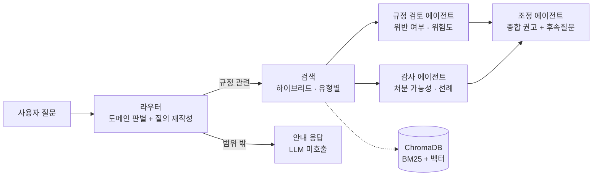
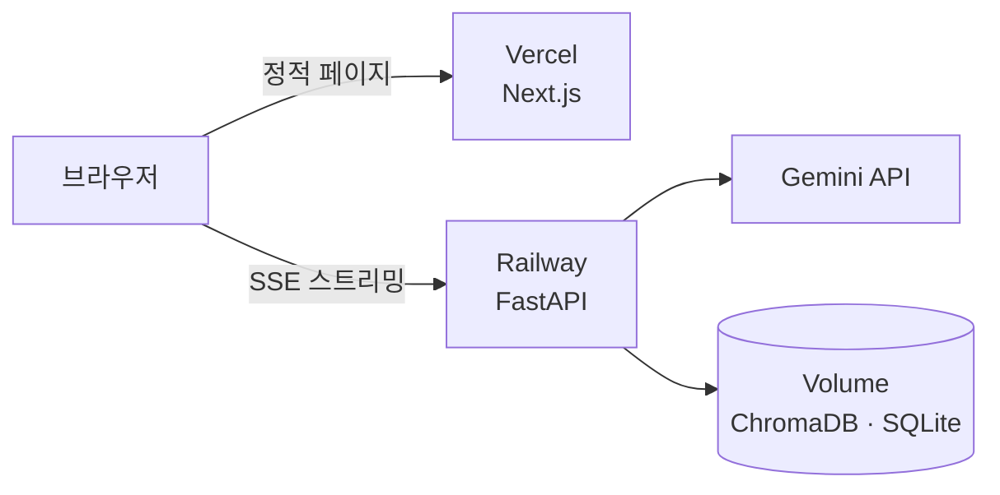

<div align="center">

# 학생회 규정 AI 어시스턴트

**학생회 회칙·세칙·감사보고서를 근거로 "이거 규정 위반인가요? 감사 처분 받나요?"에 답하는 멀티에이전트 RAG 챗봇**

인하대학교 학생회를 대상으로 실제 운영 중인 서비스입니다.

[](https://ai-agent-patrick-16be.vercel.app)
[](https://github.com/Patrick-SCH03/AI_agent/actions/workflows/ci.yml)

</div>

---

## 왜 만들었나

학생회 임원은 매 학기 바뀌지만, 지켜야 할 규정은 회칙·세칙 여러 건에 흩어져 있습니다.
그 결과 **"몰라서" 규정을 어기고 감사에서 처분을 받는 일**이 반복됩니다 — 사전 인준 없이 예산을 집행하거나, 증빙을 갖추지 않고 물품을 구매하거나.

문제는 규정을 안 읽어서가 아니라 **찾기 어려워서**입니다. 40페이지 세칙에서 내 상황에 해당하는 조항을 찾고, 과거 감사보고서에서 유사 사례가 어떻게 처분됐는지 확인하는 일은 임원 개인이 감당하기 어렵습니다.

이 프로젝트는 그 과정을 **자연어 질문 하나**로 대체합니다.

---

## 기술 스택

<table>
<tr>
<td align="center" width="33%">

### AI · RAG


**Gemini 3.7 Flash**<br/>
`gemini-embedding-2`<br/>
**LangGraph 1.0**<br/>
**ChromaDB** · **NetworkX** · pypdf

</td>
<td align="center" width="33%">

### Back-end


**FastAPI** · SSE 스트리밍<br/>
**SQLite** · **Docker**<br/>
**Railway** (배포)

</td>
<td align="center" width="33%">

### Front-end


**Next.js 16** (App Router)<br/>
**React 19** · **TypeScript**<br/>
**Tailwind CSS v4**<br/>
**Vercel** (배포)

</td>
</tr>
</table>

<div align="center">

**CI/CD** &nbsp;·&nbsp;  &nbsp; GitHub Actions → Vercel · Railway 자동 배포

</div>

| 영역 | 선택 | 이유 |
|---|---|---|
| **LLM** | Gemini 3.7 Flash | 한국어 규정 해석 품질 대비 비용이 낮고, 스캔본 PDF를 멀티모달로 직접 파싱 가능 |
| **오케스트레이션** | LangGraph 1.0 | 조건부 라우팅과 fan-out 병렬 실행을 그래프로 선언 — 에이전트 추가 시 구조 변경 최소화 |
| **벡터 DB** | ChromaDB | 문서 추가·삭제·재색인을 운영 중 수행해야 해서, 인덱스 파일 재생성형(Faiss 등)보다 컬렉션 관리형이 적합 |
| **검색** | BM25 + 벡터 (RRF) | 규정 질의는 `제32조` 같은 정확한 표현과 의미 유사도가 둘 다 필요 — 한쪽만으로는 놓친다 |
| **스트리밍** | SSE | 응답에 10초 안팎이 걸려 진행 상황 노출이 필수. WebSocket은 단방향 스트림에 과함 |
| **DB** | SQLite | 단일 인스턴스 운영 규모에서 별도 DB 서버는 과투자 — 볼륨에 파일로 보존 |

---

## 어떻게 동작하나

질문 하나에 **관점이 다른 두 전문가**를 병렬로 붙이고, 세 번째 에이전트가 종합합니다.



- **규정 검토 에이전트**는 "이 행위가 회칙·세칙에 어긋나는가"를 봅니다
- **감사 에이전트**는 "실제로 처분받을 가능성이 있는가"를 과거 감사 선례에서 확인합니다
- 둘은 **동시에** 실행되고, **조정 에이전트**가 결과를 종합합니다. 두 판단이 갈릴 때만 그 이유를 답변에 노출합니다
- 검색은 두 에이전트 앞단에서 **한 번만** 수행합니다. 각자 돌리던 시절 두 결과가 매번 동일했기 때문입니다

### 배포 구조



API는 브라우저가 백엔드로 **직접** 호출합니다. 프록시를 거치면 20~30초 걸리는 스트리밍 응답이 서버리스 함수 타임아웃에 걸리기 때문입니다.

---

## 실제 답변 예시

> **Q. 비룡제 VAT 누락 관련해서 어떤 감사 처분이 있었나요?**
>
> `위험도: 높음`
>
> **핵심 요약** — 2025학년도 제44대 총학생회의 비룡제 사업 중 발생한 VAT 누락 및 인준 없이 졸업준비금으로 충당·지출한 건에 대해, 직무태만 및 재정상 손실 발생을 사유로 총학생회장·부총학생회장에게 **해임건의**, 총학생회에 **예산집행정지 21일**이 의결되었습니다.
>
> **최종 권고** — 「감사처분에 관한 세칙」 1-나(직무태만으로 재정상 손실) 및 예산집행정지기준 6-다(인준 없이 사업 진행)에 따라 (…)
>
> **근거 문서** — `25-2 총학생회_특별감사_보고서.pdf` · `감사처분에 관한 세칙.pdf`

---

## 측정된 결과

배포본 기준. 평가셋 50건과 자체 계측 지표로 잰 값입니다.

| 지표 | 값 |
|---|---|
| **답변 품질** | 평가셋 **50/50 통과** (라우팅·근거 문서·키워드·실명 비노출) |
| **검색 정확도** | 기대 문서 적중 41/41 · 평균 순위 **1.93위** (MRR 0.861) |
| **응답 시간** | 규정 질의 평균 **9.4초** · 범위 밖 질문 1초대 |
| **반복 질문** | 캐시 적중 시 **0.3초** (LLM 미호출) |
| **질의당 토큰** | 입력 14,600 · 출력 3,400 |
| **색인 규모** | 33문서 · 550청크 |
| **판례 집계 (multi-hop)** | 인용 그래프 확장으로 근거 회수율 **32%→83%**, 답변 판례 커버리지 **44%→76%** (9케이스 A/B) |

프롬프트 구성을 측정해 중복 검색을 제거하고 컨텍스트를 조정한 결과, 입력 토큰은
**18,702 → 14,600 (-22%)** 로 줄었고 품질 지표는 유지됐습니다.

---

## 주요 기능

| 기능 | 설명 |
|---|---|
| **멀티에이전트 분석** | 규정 검토·감사 분석을 병렬 실행 후 종합 권고 도출 |
| **하이브리드 검색** | BM25 키워드 + 벡터 검색을 RRF로 융합, 조항 번호(`제32조`)까지 정확히 조회 |
| **조항 단위 청킹** | 회칙·세칙을 조항 경계로 분할해 인용 근거가 중간에서 잘리지 않도록 처리 |
| **조항 단위 출처 인용** | 답변 근거를 문서·조항까지 표시, 클릭하면 원문 문단 확인 |
| **판례 집계 (Graph RAG)** | 규정 인용 그래프로 조항→감사 판례를 문서 경계 넘어 수집. 판례형 질문에만 라우터가 활성화 |
| **결정론적 위험도 판정** | LLM 텍스트 파싱이 아닌 구조화 출력(enum) 기반 계산 |
| **실시간 스트리밍** | 진행 단계 표시 → 에이전트별 부분 결과 → 최종 답변 토큰 스트리밍 |
| **대화 맥락 유지** | "그럼 처분은 얼마나 돼?" 같은 후속 질문을 이전 대화 기준으로 해석 |
| **스캔본 PDF 자동 처리** | 텍스트 레이어 없는 문서를 Gemini 멀티모달로 추출 (OCR 엔진 불필요) |
| **개인정보 삼중 방어** | 실명이 든 질문은 입구에서 거절(LLM 미호출), 프롬프트로 실명을 직책으로 치환, 출력 직전 코드가 실명·전화·계좌·이메일을 한 번 더 마스킹 (스트리밍 경계 포함) |
| **도메인 가드** | 학생회 업무 밖 질문은 LLM 호출 없이 안내 응답 |
| **답변 캐싱** | 반복 질문은 LLM 호출 없이 재사용 (8.5초 → 0.3초), 문서 변경 시 자동 무효화 |
| **사용량 상한** | 전체·사용자·IP 기준 일일 한도, 관리자 페이지에서 조절 |
| **품질 회귀 테스트** | 평가셋 50건으로 라우팅·근거 문서·키워드·실명 노출을 자동 검증 |
| **운영 대시보드** | 질의 수·응답 시간·토큰·비용·방문자 추이 자체 계측 (`/stats`, 관리자 전용) |

---

## 기술적으로 신경 쓴 부분

<details>
<summary><b>1. 한글 PDF의 널바이트 오염 — 검색 품질이 무너지던 원인</b></summary>

<br/>

일부 한글 PDF는 공백을 널바이트(`\x00`)로 추출합니다. 색인된 문서 중 **14개가 오염되어 공백 비율 0%**, 즉 모든 단어 경계가 사라진 상태였습니다. 텍스트는 "있어 보이지만" 임베딩 품질이 무너져 핵심 세칙들이 검색 결과에서 밀려났습니다.

→ 인제스천 단계에 정규화(널바이트·특수공백 복원, NFKC, 제어문자 제거)를 넣어 해결.

</details>

<details>
<summary><b>2. 문서 유형 분리 검색 — 코퍼스가 커질수록 악화되던 구조</b></summary>

<br/>

감사보고서(19건)가 회칙·세칙(12건)보다 수적으로 많아, 유형 구분 없이 상위 K개를 뽑으면 **정작 규정 조항이 감사보고서에 밀려났습니다.** "회식비 사용 가능한가요?"에 재정·회계 세칙이 검색되지 않는 상태였습니다.

→ 문서를 `regulation`/`audit`으로 분류해 메타데이터에 저장하고, 규정 검토 에이전트는 회칙·세칙을, 감사 에이전트는 감사 선례를 각각 보장받도록 분리 검색. 문서가 늘어나도 재발하지 않는 구조.

</details>

<details>
<summary><b>3. 본문이 이미지인 PDF 탐지 — 절대 길이 기준의 함정</b></summary>

<br/>

"추출 텍스트가 50자 미만이면 스캔본"이라는 기준은, **표지와 목차만 텍스트고 본문이 이미지인 문서**를 놓칩니다. 18페이지 감사보고서에서 851자(목차)만 추출된 채 정상 처리된 사례가 있었습니다.

→ 판정 기준을 **페이지당 평균 글자 수**로 변경. 해당 문서는 1청크 → 19청크로 복구.

</details>

<details>
<summary><b>4. 도메인 가드로 비용 95% 절감</b></summary>

<br/>

"쿠팡에서 실수로 포인트 적립을 했어" 같은 개인 소비 질문이 규정 분석 파이프라인으로 오분류되어, 불필요한 검색과 3회의 LLM 호출이 발생했습니다(질의당 약 16,000 토큰).

→ 라우터 판단 기준을 "질문의 주체가 학생회 활동인가"로 명문화하고 few-shot 예시 추가, 범위 밖 질문은 LLM 호출 없이 고정 안내로 응답. **토큰 16,780 → 897 (약 95% 절감).** 자체 구축한 관측 대시보드로 발견한 문제입니다.

</details>

<details>
<summary><b>5. 공개 배포 전 관리자 API 차단</b></summary>

<br/>

셀프호스팅 시절에는 사설망 안이라 문제없던 문서 관리·운영 지표 API가, 공개 배포 시에는 **URL만 알면 누구나 문서를 삭제하고 전체 질의 로그를 열람**할 수 있는 상태였습니다.

→ `ADMIN_TOKEN` 기반 Bearer 인증을 붙이되, **토큰 미설정 시 열어두지 않고 503으로 차단**(fail-closed)하도록 설계. 배포 시 환경변수를 빠뜨려도 무방비 노출되지 않습니다.

</details>

<details>
<summary><b>6. 무료 티어에서 안정적으로 돌리기</b></summary>

<br/>

임베딩 API의 쿼터 제한(429)과 일시 장애(503)로 일괄 색인이 중단되곤 했습니다.

→ 배치 축소 + 지수 백오프 재시도, 개별 문서 실패가 전체를 중단시키지 않도록 격리. 31개 문서 일괄 색인이 무인으로 완주합니다.

</details>

<details>
<summary><b>7. 임베딩이 놓치는 정확한 표현 — 하이브리드 검색과 조항 단위 청킹</b></summary>

<br/>

벡터 검색만으로는 `제32조`, `비룡제` 같은 **정확히 일치해야 하는 표현**을 놓칩니다. 의미가 비슷한 다른 조항이 먼저 잡히기 때문입니다.

→ BM25 키워드 검색을 붙이고 벡터 결과와 **RRF(Reciprocal Rank Fusion)** 로 융합했습니다. 두 검색의 점수 체계가 달라도 순위만으로 합칠 수 있습니다. 한국어 형태소 분석기 없이 동작하도록 조항 표기를 단일 토큰으로 보존하고 한글은 2-gram을 함께 넣어 조사 변화를 흡수하는 경량 토크나이저를 만들었습니다.

함께 청킹도 바꿨습니다. 고정 길이로 자르면 조항이 중간에서 끊겨 인용 근거가 불완전해집니다. 조항 제목의 괄호 유무(`제10조(목적)` vs `제29조에 따라`)로 헤딩과 본문 참조를 구분해 **조항 경계로만** 자릅니다.

한 문서가 결과를 독점하지 않도록 문서별 상한도 뒀습니다. LLM 리랭커 대신 이 방식을 택한 이유는, 리랭킹용 LLM 호출을 더하면 지연과 비용이 함께 늘기 때문입니다. **근거 문서 수 2.08 → 2.92종.**

구현 중 BM25 색인 생성이 컬렉션 접근을 다시 요구하면서 **락이 자기 자신을 기다리는 데드락**이 있었습니다. 재진입 가능한 `RLock`으로 해결했고, 배포 전에 잡았습니다.

</details>

<details>
<summary><b>8. 처분이 3건인데 1건만 답한 문제 — 로컬은 통과, 배포본은 실패</b></summary>

<br/>

"비룡제 VAT 누락 관련 감사 처분"에 답변이 **부총학생회장 해임건의 하나만** 내놓았습니다. 실제 문서에는 처분이 3건 기재되어 있습니다.

프롬프트 문제로 보고 처분을 모두 나열하라는 규칙을 넣었더니 **로컬은 통과하는데 배포본은 계속 실패**했습니다. 원격에 직접 물어보니 "예산집행정지 21일"을 정확히 답합니다 — 색인은 멀쩡하고 검색 순위가 문제였습니다. 같은 사안인데 그 처분의 사유가 'VAT 누락'이 아닌 '인준 누락'으로 적혀 있어 질의어와 겹치지 않았던 겁니다.

→ 감사보고서 검색 결과에 **인접 청크(±1)** 를 덧붙여 열거가 청크 경계에서 잘리지 않게 했습니다.

로컬과 배포본이 갈린 원인은 따로 있었습니다. **Gemini OCR이 같은 PDF에도 매번 다른 텍스트를 내놓아** 청크 경계가 달라졌고(로컬 19청크 / 원격 20청크), 그래서 로컬에서 재현되지 않았습니다. OCR 결과를 파일 해시 기준으로 캐싱해 재현성을 확보했습니다.

</details>

<details>
<summary><b>9. 100%인 지표는 아무것도 알려주지 않는다</b></summary>

<br/>

하이브리드 검색과 조항 청킹을 넣고 평가셋을 돌렸는데 통과율이 **19/20에서 그대로**였습니다. 개선이 없었던 게 아니라 **20건짜리 평가셋이 그 차이를 담지 못했습니다.**

검색만 따로 재보니 적중률도 12/13 → 12/13으로 변화가 없었습니다. 후보를 10개 넘게 보는데 적중률을 재면 당연히 포화됩니다.

→ 평가셋을 50건으로 늘리고, **기대 문서가 몇 번째로 나오는지(MRR)** 를 함께 재도록 바꿨습니다. 상한이 없어 포화되지 않습니다. LLM을 부르지 않는 `--retrieval` 모드를 만들어 검색 변경을 싸게 검증할 수 있게 했습니다.

이 지표를 기준선으로 두고 프롬프트를 줄였습니다. 검토·감사 에이전트가 **같은 규정 검색을 각각 돌리고 있었고**(8건 전부 결과 동일), 검색을 앞단으로 빼 한 번만 수행하도록 바꿨습니다. 입력 토큰 **18,702 → 14,600 (-22%)**, MRR과 평가셋 통과율은 그대로입니다.

</details>

<details>
<summary><b>10. 내가 만든 IP 상한을 내가 우회할 수 있었다</b></summary>

<br/>

일일 한도가 브라우저 저장소에 든 `visitor_id` 하나에만 걸려 있어, 저장소를 비우면 초기화됐습니다. IP 기준 상한을 추가했는데 — **그 구현 자체에 구멍이 있었습니다.**

`X-Forwarded-For`의 첫 항목을 읽고 있었습니다. 이 헤더는 클라이언트가 직접 보낼 수 있고 프록시는 그 **뒤에** 실제 IP를 덧붙입니다. 매번 다른 값을 앞에 넣으면 서버는 위조값만 보게 되어 상한이 무의미해집니다.

→ 앞단 프록시가 마지막에 붙인 **오른쪽 끝 항목**을 쓰도록 수정. IP는 솔트 해시로만 저장하고 원문은 남기지 않습니다. 프록시가 실제 IP를 넘겨주는지 운영 중 확인할 수 있도록 고유 IP 수를 지표에 넣었습니다.

</details>

<details>
<summary><b>11. Graph RAG를 검토하고, 이 규모에 맞는 형태만 채택했다</b></summary>

<br/>

"과거에 어떤 처분 사례들이 있었나"라는 질문에 하이브리드 검색은 **판례의 일부만** 가져왔습니다. 같은 조항을 위반한 사례가 여러 대학 보고서에 흩어져 있는데, 검색어와 표면적으로 겹치는 문서만 잡히기 때문입니다.

Neo4j·Microsoft GraphRAG 도입을 검토했지만 **기각**했습니다 — 이 규모(문서 33건)에서 LLM 기반 그래프 추출은 색인 비용이 크고, 벤치마크상 소규모 코퍼스에선 vanilla RAG보다 오히려 성능이 낮은 경우가 보고돼 있습니다. 대신 규정 문서의 정형성을 이용했습니다: 조항 참조("「재정·회계 세칙」 제32조", "동 세칙 제9조")를 **정규식 + 상태기계로 결정론적으로 추출**해 NetworkX 그래프(1,131노드/813엣지)를 만들었습니다. 구축 2초·LLM 비용 0원, 색인할 때마다 전체 재생성이라 그래프가 낡을 일이 없습니다.

검색 결과를 이 그래프로 1-hop 확장하면 근거 회수율이 **32%→83%** (인용 그래프에서 생성해 본문 검증한 multi-hop 평가셋 기준), 답변의 판례 커버리지가 **44%→76%** 올랐습니다. 다만 일반 질의에서도 게이트가 98% 열려 전역 적용 시 질의당 +7원·+2초의 회귀가 생기는 것을 실측하고, **라우터(경량 모델)가 '판례 집계형'으로 판별한 질문에만 확장을 켜는** 방식으로 채택했습니다 — 좋아지는 질의만 비용을 냅니다.

</details>

---

## 프로젝트 구조

```
├── api/                      # FastAPI 백엔드
│   ├── app/
│   │   ├── agents/           # graph.py(LangGraph) · prompts.py · schemas.py
│   │   ├── rag/              # ingest.py(추출·정규화) · store.py(벡터 검색)
│   │   ├── main.py           # SSE 채팅 API · 관리자 API
│   │   ├── db.py             # 분석 이력 · 운영 지표 · 방문자 로그
│   │   └── config.py
│   ├── ingest_folder.py      # 폴더-색인 동기화 CLI
│   ├── upload_to_remote.py   # 배포 서버로 문서 업로드 CLI
│   ├── evaluate.py           # 답변·검색 품질 회귀 테스트
│   ├── evalset.json          # 평가셋 50건 (기대 라우팅·근거·키워드)
│   └── smoke_test.py
├── web/                      # Next.js 프론트엔드
│   └── src/app/              # page.tsx(채팅) · stats/(운영 대시보드)
├── documents/                # 규정 PDF 원본 (git 제외 — 내부 문서)
└── .github/workflows/        # CI
```

---

## 시작하기

### 백엔드

```bash
cd api
python -m venv .venv
.venv\Scripts\activate           # Linux/Mac: source .venv/bin/activate
pip install -r requirements.txt
cp .env.example .env             # GEMINI_API_KEY, ADMIN_TOKEN 입력
uvicorn app.main:app --port 8000
```

> API 키가 없어도 **목업 모드**로 전체 플로우를 실행해볼 수 있습니다 (LLM 호출 없이 canned 응답).
> 키 발급: [Google AI Studio](https://aistudio.google.com/apikey)

### 프론트엔드

```bash
cd web
npm install
npm run dev                      # http://localhost:3000
```

### 규정 문서 색인

`documents/` 폴더에 PDF를 넣고 실행하면 폴더 상태와 색인을 동기화합니다.

```bash
cd api
.venv\Scripts\python ingest_folder.py
```

**신규** 파일은 색인, **수정된** 파일은 재색인, **삭제된** 파일은 색인에서 제거합니다.

### 품질 회귀 테스트

프롬프트나 검색 설정을 바꾼 뒤 실행합니다.

```bash
cd api
.venv\Scripts\python evaluate.py --retrieval    # 검색만 (LLM 미호출, 거의 무료)
.venv\Scripts\python evaluate.py                # 전체 (실제 LLM 호출)
```

---

## API

| 메서드 | 경로 | 인증 | 설명 |
|---|---|:---:|---|
| `POST` | `/api/chat` | — | SSE 스트리밍 분석 (`stage` / `agent_done` / `token` / `result`) |
| `GET` | `/api/health` | — | 상태 확인 (모드, 모델, 색인 청크 수) |
| `POST` | `/api/feedback` | — | 답변 평가 (도움됨 / 부족함) |
| `GET` | `/api/stats` | 필요 | 운영 지표 (질의·응답시간·토큰·비용·방문자) |
| `GET` | `/api/stats/export` | 필요 | 지표 CSV 내보내기 |
| `GET` | `/api/history` · `/api/analyses/{id}` | 필요 | 분석 이력 |
| `POST` `GET` `DELETE` | `/api/documents` | 필요 | 문서 색인 관리 |
| `GET` `PUT` | `/api/settings` | 필요 | 일일 한도·캐시 TTL 조회 및 변경 |
| `POST` | `/api/cache/clear` | 필요 | 답변 캐시 비우기 |

인증이 **필요**로 표시된 엔드포인트는 `Authorization: Bearer <ADMIN_TOKEN>` 헤더를 요구합니다.

---

## 개발 컨벤션

커밋 메시지 규칙, 브랜치 전략, CI 구성은 **[CONTRIBUTING.md](CONTRIBUTING.md)** 를 참고하세요.

---

## 주의

- 이 저장소에는 **규정 PDF 원본이 포함되어 있지 않습니다** (학생회 내부 문서).
- 본 서비스의 AI 분석은 **참고용**이며, 최종 판단은 감사위원회 및 관련 규정을 따릅니다.
