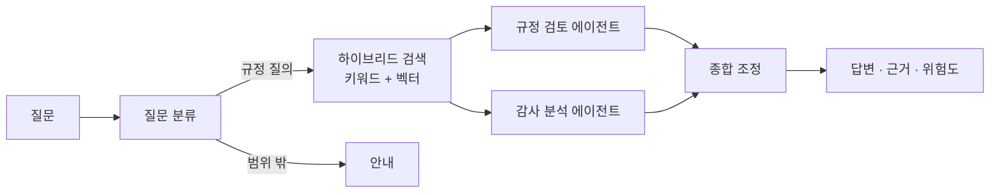

# 학생회 업무 AI

**회칙·세칙·감사보고서를 근거로 규정 질문에 답하고, 예산 문서 검토·기획안·공문 작성까지 돕는 학생회 업무 플랫폼**

인하대학교 학생회를 대상으로 실제 운영 중인 서비스입니다.

---

## 소개

학생회 임원은 매 학기 바뀌지만, 지켜야 할 규정은 회칙·세칙 여러 건에 흩어져 있습니다.
그래서 **"몰라서" 규정을 어기고 감사에서 처분을 받는 일**이 반복됩니다.

이 서비스는 그 확인 과정을 **자연어 질문 하나**로 대체합니다. 질문을 받으면 관련 조항과 과거 감사 사례를 찾아,
위반 여부·위험도·처분 가능성을 **조항 단위 출처와 함께** 답합니다.

---

## 주요 기능

| 기능 | 설명 |
|---|---|
| **규정 질문** | 로그인 없이 익명으로 묻고, 조항·감사 사례를 근거로 답을 받습니다. |
| **문서 검토** | 예산안·정산서(PDF·한글·워드·엑셀)를 올리면 합계·예비비·표끼리 금액·엑셀 수식을 **계산으로** 검사하고, 규정 해석이 필요한 부분은 조항과 함께 알려 줍니다. 원본 파일은 저장하지 않습니다. |
| **기획 도우미** | 행사 개요를 넣으면 총대의원회 양식의 사업계획서·예산안 초안을 만듭니다. 금액·예비비·일정은 **코드가 계산**합니다. |
| **문서 작성** | 지급 확인서·경위서·예산 변경 사유서·공문·사령·회의록을 Word로, 정산표를 엑셀로 만듭니다. |
| **감사 대비·법령 점검** | 감사자료를 점검하고, 주점·상금·개인정보·저작권 등 행사별 법령 점검표를 봅니다. |

문서 검토·기획 도우미·회의록 정리는 학교 Google 계정으로 로그인해 씁니다.

---

## 어떻게 동작하나

```mermaid
flowchart LR
    Q[질문] --> R[질문 분류]
    R -->|규정 질의| S[하이브리드 검색<br/>키워드 + 벡터]
    R -->|범위 밖| G[안내]
    S --> A1[규정 검토 에이전트]
    S --> A2[감사 분석 에이전트]
    A1 --> C[종합 조정]
    A2 --> C
    C --> ANS[답변 · 근거 · 위험도]
```

- **멀티에이전트:** 규정 검토와 감사 분석을 두 에이전트가 동시에 수행하고, 조정 에이전트가 하나의 권고로 종합합니다.
- **하이브리드 검색:** "제32조" 같은 정확한 표현은 키워드 검색이, 뜻이 같은 다른 표현은 벡터 검색이 찾고 순위를 융합합니다.
- **결정론적 위험도:** 에이전트의 판정을 구조화 출력으로 받아 최종 위험도는 코드가 계산합니다.
- **개인정보 보호:** 감사보고서의 실명은 답변과 저장 기록에서 코드로 한 번 더 지웁니다.

---

## 기술 스택

| 영역 | 사용 기술 |
|---|---|
| **AI** | Claude Haiku 5.5 (분류·분석·종합·문서 추출·초안) · Gemini 임베딩 · LangGraph |
| **백엔드** | Python · FastAPI · ChromaDB · SQLite · SSE 스트리밍 · Google 로그인(학교 계정) |
| **프론트엔드** | Next.js · React · TypeScript · Tailwind CSS · docx·exceljs (브라우저에서 파일 생성) |
| **운영** | Docker · Railway · Vercel · GitHub Actions |

---

## 주의

- 학생회 업무를 돕는 참고 도구이며, 공식 해석이나 법적 판단을 대신하지 않습니다.
- 학습·검색에 쓰는 내부 문서는 저장소에 포함하지 않습니다.
